<h1 align="center">
  <br/>
  <strong>Tuka's Comic Book Characters Manager</strong>
</h1>

<p align="center">
  A Java desktop application for managing comic book characters with a database-backed system.
</p>

<hr/>

## System Requirements

Ensure the following tools are installed to build and run the project:

- **[Apache Maven 3.9.9+](https://maven.apache.org/download.cgi)**: Build automation and project management tool for Java-based projects.

- **[Java Development Kit (JDK) 17+](https://www.oracle.com/au/java/technologies/downloads/)**: Required to compile and run the application.
    - Ensure `JAVA_HOME` is properly configured on your system.

- **[Git](https://git-scm.com/download/)**: Enables version control and collaborative development.
    - Git maintains strong backward compatibility, so any recent version should work fine.

- **(Optional) [PostgreSQL 16.8+](https://www.postgresql.org/download/)**: Used for setting up a local database instance.
    - Includes [pgAdmin](https://www.pgadmin.org/) for database management (bundled with standard installation).

---

## Installation Guide

### 1. Clone the repository

```
git clone https://github.com/hotungkhanh/comic-characters.git
```
```
cd comic-characters
```

### 2. Configure database connection

Create a `.env` file in the project root directory:

```properties
DB_URL={your PostgreSQL database URL}
DB_USERNAME={your PostgreSQL username}
DB_PASSWORD={your PostgreSQL password}
```

### 3. Run the application

Choose one of the following methods:

<details>
<summary><strong>Option A: Using the command line</strong></summary>

Build the application:
```bash
mvn clean package
```

Run the JAR file:
```bash
java -jar target/comic-characters-1.0-SNAPSHOT.jar
```
</details>

<details>
<summary><strong>Option B: Using an IDE</strong></summary>

1. Open the project in your IDE (IntelliJ IDEA, Eclipse, etc.)
2. Navigate to the main class:
   ```
   src/main/java/com/tuka/comiccharacters/ui/MainApp.java
   ```
3. Run the `main()` method:

   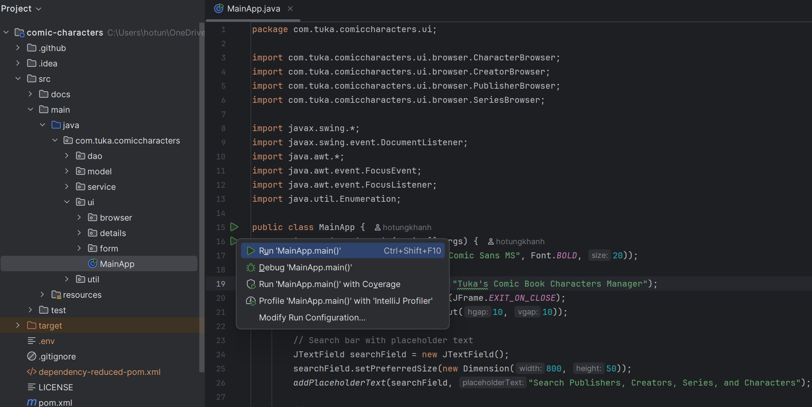
</details>

### 4. Verify installation

The application should launch displaying the main user interface. You're now ready to manage your comic character collection!

---

## Features

### [Main UI](#main-ui)

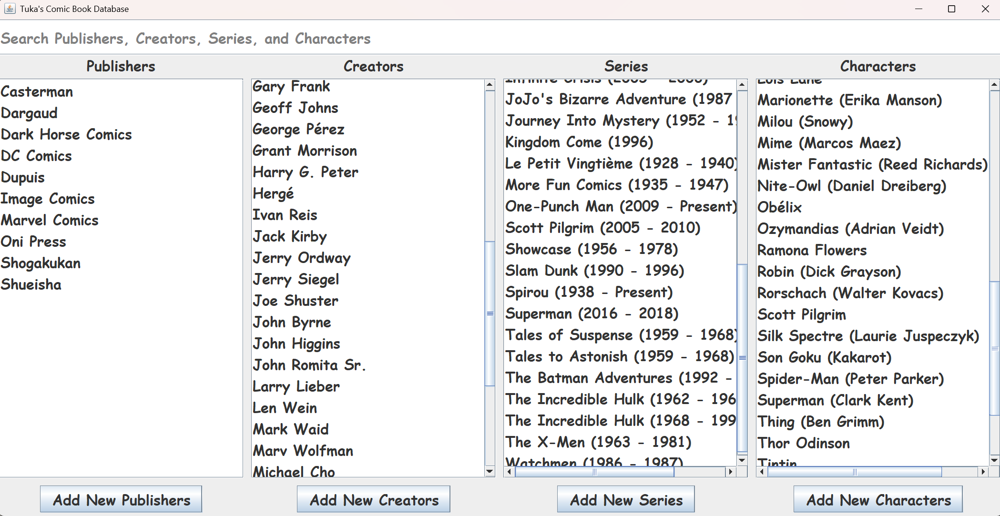

The main UI is your central hub for browsing and searching publishers, creators, series, and characters in the database.  
Clicking a row in any browser pane opens a [Details Pop-Up](#details-pop-up) for that entity.  
Each section also includes an **"Add New"** button that launches a [Form Pop-Up](#form-pop-up) to create a new entry in the respective table.

### [Details Pop-Up](#details-pop-up)

Each pop-up provides detailed information for a specific entity (publisher, creator, series, issue, or character).  
Use the **Edit** and **Delete** buttons to update with the [Form Pop-Up](#form-pop-up) or remove the entry from the database.

<details>
  <summary><strong><a id="publisher-details">Publisher Details</a></strong></summary>

Displays an overview of the publisher, along with related series and characters.  
Clicking a row opens the corresponding [Series Details](#series-details) or [Character Details](#character-details).

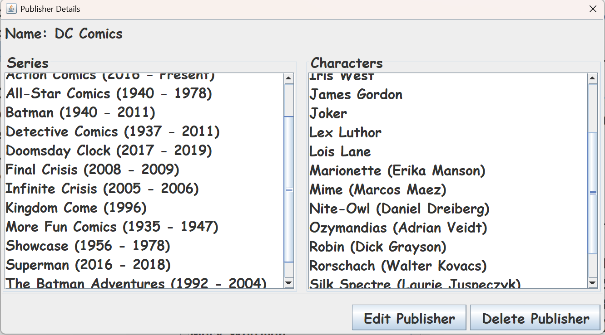
</details>

<details>
  <summary><strong><a id="creator-details">Creator Details</a></strong></summary>

Shows the creator's profile, credited characters, and issues they contributed to.  
Click a row to view [Character Details](#character-details) or [Issue Details](#issue-details).

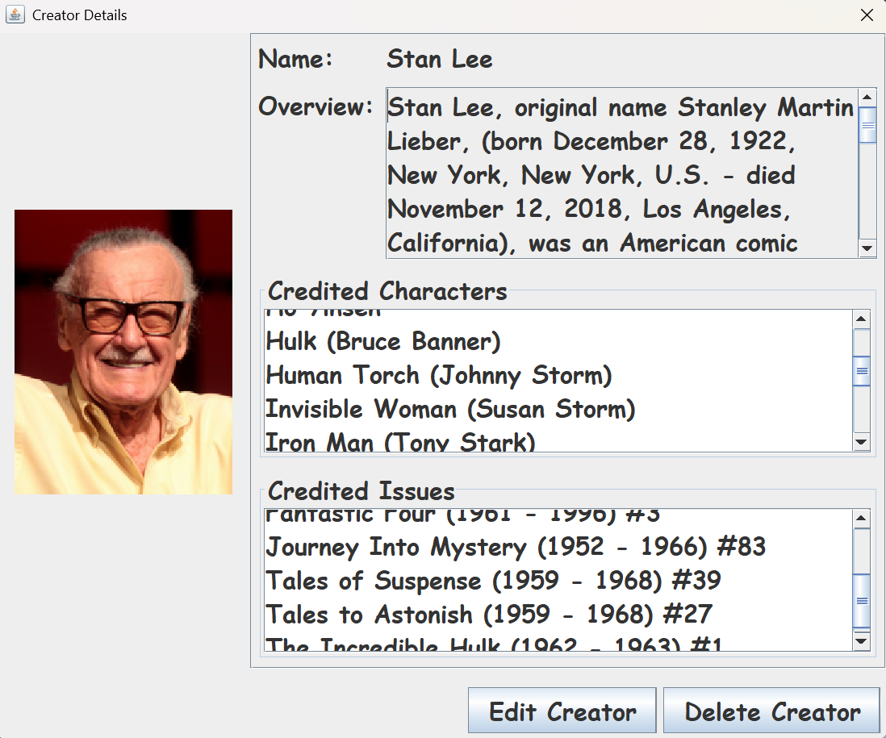
</details>

<details>
  <summary><strong><a id="series-details">Series Details</a></strong></summary>

Includes title, publication years, publisher, an overview, and a list of related issues.  
Click the publisher to view [Publisher Details](#publisher-details) or an issue to view [Issue Details](#issue-details).  
Use the **"Add New Issues"** button to add issues linked to this series.

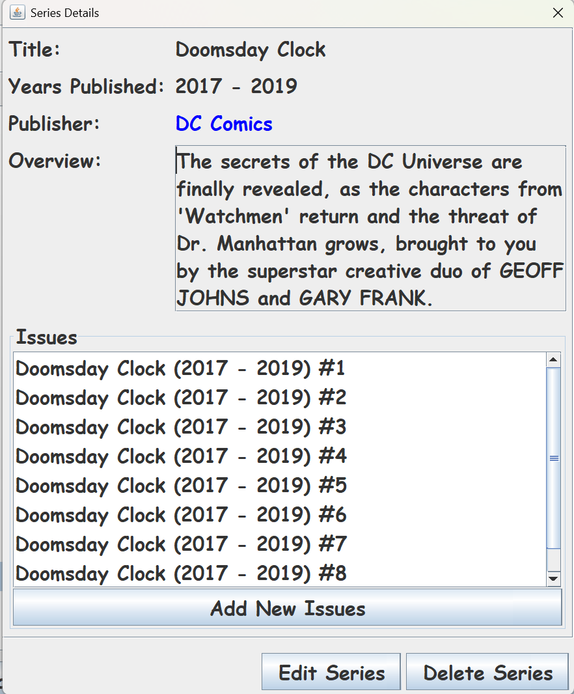
</details>

<details>
  <summary><strong><a id="issue-details">Issue Details</a></strong></summary>

Provides release details (publisher, date, price), an overview, and lists of involved creators and characters.  
Links navigate to [Series Details](#series-details), [Publisher Details](#publisher-details), [Creator Details](#creator-details), or [Character Details](#character-details) depending on the selected item.

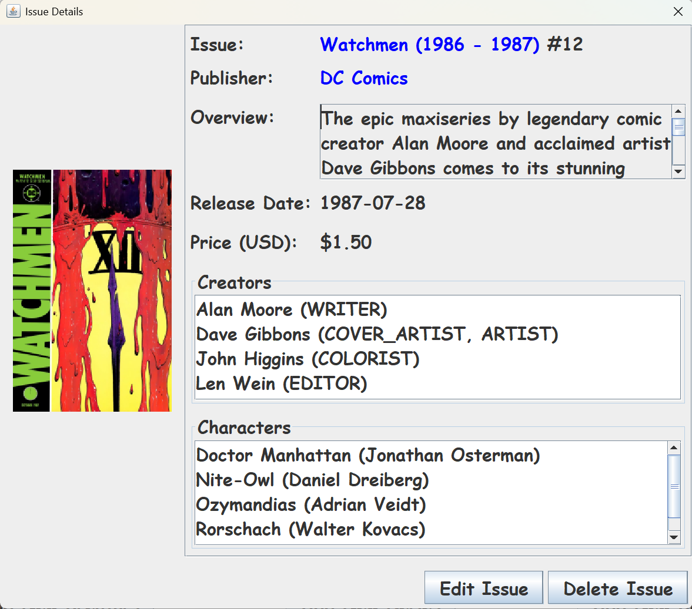
</details>

<details>
  <summary><strong><a id="character-details">Character Details</a></strong></summary>

Displays the character's publisher, alias, overview, creators, first appearance, and list of featured issues.  
Links navigate to [Publisher Details](#publisher-details), [Creator Details](#creator-details), or [Issue Details](#issue-details) accordingly.

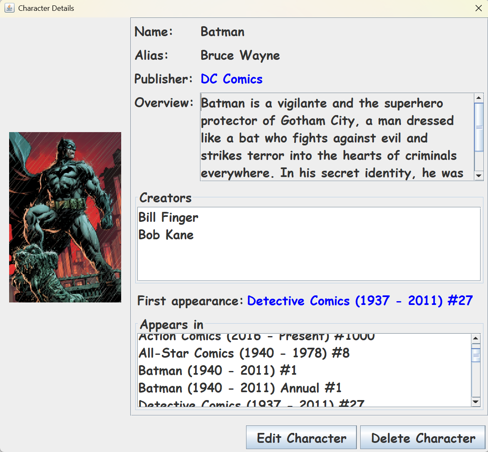
</details>

### [Form Pop-Up](#form-pop-up)

Clicking **"Add New"** opens a blank form for creating entries. Adding new entries does not close the form, allowing multiple submissions.  
Clicking **"Edit"** auto-fills the form with the existing entry's information and closes after saving.

<details>
  <summary><strong><a id="publisher-form">Publisher Form</a></strong></summary>

Enter the publisher's name and click the button to save.

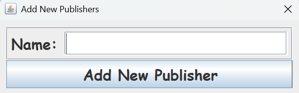
</details>

<details>
  <summary><strong><a id="creator-form">Creator Form</a></strong></summary>

Input the creator's name, image URL, and an overview (max 3000 characters).  
Click the button to save.

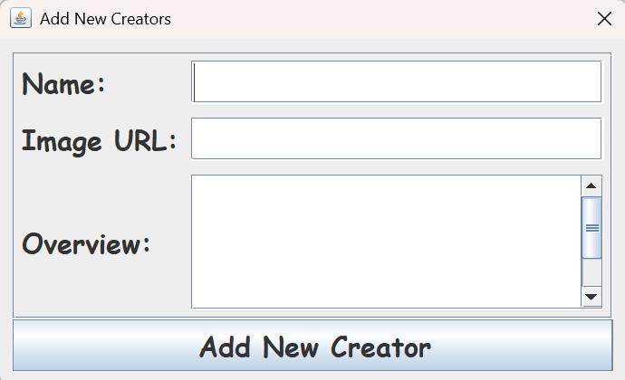
</details>

<details>
  <summary><strong><a id="series-form">Series Form</a></strong></summary>

Enter the series title, publication years, and an overview (max 3000 characters).  
Select the publisher from the dropdown (keyboard search supported), then click the button to save.

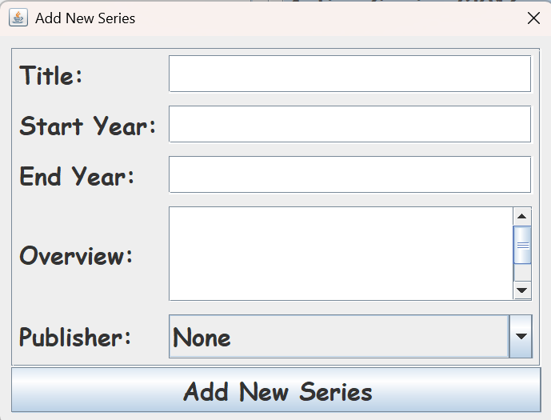
</details>

<details>
  <summary><strong><a id="issue-form">Issue Form</a></strong></summary>

Fill in the issue number, overview (max 3000 characters), release date (YYYY-MM-DD), price in USD, and image URL.
- **Annual** checkbox: Marks the issue as an annual.
- **Creators**: Search, select roles, and click **Add Creator(s) by Roles**. Multiple selections allowed (Ctrl/Cmd).
- **Characters**: Search, select, and click **Add Character(s)**.

Double-check all tables before clicking the button to save.

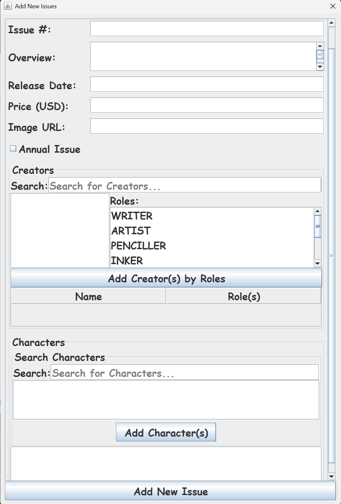
</details>

<details>
  <summary><strong><a id="character-form">Character Form</a></strong></summary>

Provide name, alias, image URL, and overview (max 3000 characters).
- Select publisher from the dropdown (keyboard search supported).
- **Creators**: Search, select, and click **Add Creator(s)**. Multiple selections allowed (Ctrl/Cmd).
- **First Appearance**: Choose a series, then an issue (required if series is chosen).

Click the button to save.

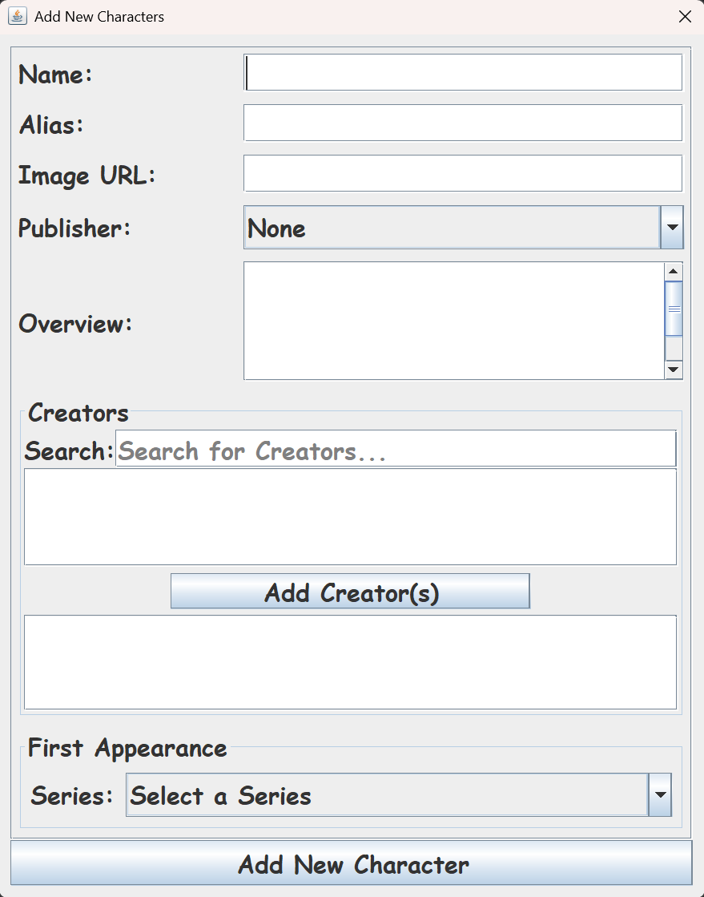
</details>


### Search Bar

Once entries have been added to the database, users can quickly locate them using the search bar in the main UI.  
The search queries across all Publishers, Creators, Series, and Characters.  
Clicking on a search result opens the relevant [Details Pop-Up](#details-pop-up) for that entry.

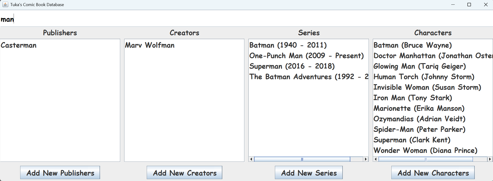


---

## Documentation

